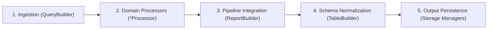

# Universal PySpark & AWS Glue Engineering Patterns

A production-grade reference for AI agents and data engineers building, optimizing, and maintaining distributed batch ETL pipelines on **AWS Glue (v4.0/v5.0)** and **Apache Spark / PySpark**.

---

## 1. When to Activate This Skill

- Writing or refactoring PySpark DataFrame transformations and aggregation logic.
- Building and optimizing SQL extraction queries against AWS Glue Data Catalog (`QueryBuilder`).
- Implementing domain processors, report consolidators, or table schema formatters.
- Applying window functions, date manipulations, conditional expressions, and joins.
- Tuning shuffle partitions, broadcast joins, data skew, and worker memory on AWS Glue (G.1X / G.2X).
- Diagnosing and resolving performance bottlenecks, shuffle spills, or Out-Of-Memory (OOM) errors.

---

## 2. Core Engineering Workflow

When implementing or modifying a PySpark pipeline, follow this 5-step lifecycle:



1. **Extraction (`QueryBuilder`):** Read from Data Catalog; push filters down to partition columns (`fecha_cargue`, `periodo`) and project only necessary fields.
2. **Domain Transformation (`<domain>_processor.py`):** Pure, stateless transformations using native Spark functions.
3. **Report Consolidation (`report_builder.py`):** Coordinate multiple processors and assemble intermediate datasets.
4. **Schema Formatting (`table_builder.py`):** Add audit columns (`fecha_cargue`, `load_timestamp`), cast data types, and normalize output schemas.
5. **Validation & Memory Control:** Ensure no un-coalesced small files are produced, no broadcast thresholds are violated, and no driver `.collect()` calls exist.

---

## 3. Glue & Spark Context Initialization Pattern

Place context setup exclusively in `src/config/spark_setup.py`:

```python
"""Module for Spark and AWS Glue context initialization."""
from typing import Tuple
from awsglue.context import GlueContext
from awsglue.job import Job
from pyspark.context import SparkContext
from pyspark.sql import SparkSession


def initialize() -> Tuple[GlueContext, SparkSession, Job]:
    """Initialize SparkContext, GlueContext, and Glue Job with optimized configurations."""
    if SparkContext._active_spark_context:
        sc = SparkContext._active_spark_context
    else:
        sc = SparkContext()

    conf = sc.getConf()
    # Datetime compatibility & partition overwrite modes
    conf.set("spark.sql.parquet.datetimeRebaseModeInRead", "CORRECTED")
    conf.set("spark.sql.parquet.datetimeRebaseModeInWrite", "CORRECTED")
    conf.set("spark.sql.sources.partitionOverwriteMode", "dynamic")
    conf.set("spark.sql.session.timeZone", "America/Bogota")
    # Adaptive Query Execution (AQE)
    conf.set("spark.sql.adaptive.enabled", "true")
    conf.set("spark.sql.adaptive.coalescePartitions.enabled", "true")

    sc.stop()
    sc = SparkContext.getOrCreate(conf=conf)

    glue_context = GlueContext(sc)
    spark_session = glue_context.spark_session
    job = Job(glue_context)

    return glue_context, spark_session, job
```

---

## 4. Query Extraction Patterns (`src/queries/query_builder.py`)

Centralize all catalog reads in `QueryBuilder`. Never apply business transformations in this layer:

```python
"""Extraction layer for AWS Glue Data Catalog sources."""
from typing import List
from pyspark.sql import DataFrame, SparkSession
from src.config.decorators import log_decorator, raise_decorator


class QueryBuilder:
    """Builds and executes Spark SQL queries against Glue Catalog databases."""

    def __init__(self, spark: SparkSession, source_db: str):
        self.spark = spark
        self.source_db = source_db

    @log_decorator
    @raise_decorator
    def get_partitioned_records(self, table_name: str, partition_dates: List[str]) -> DataFrame:
        """Extract dataset records filtered strictly by partition key."""
        formatted_dates = ", ".join(f"'{d}'" for d in partition_dates)
        query = f"""
            SELECT 
                record_id,
                entity_code,
                account_id,
                transaction_type,
                amount,
                fecha_cargue
            FROM {self.source_db}.{table_name}
            WHERE fecha_cargue IN ({formatted_dates})
        """
        return self.spark.sql(query)
```

---

## 5. Pure Transformation Patterns (`src/transformations/`)

### 5.1. Built-in Functions (Native Catalyst Execution)
Always prioritize `pyspark.sql.functions` (`F`) over Python UDFs:

```python
from pyspark.sql import DataFrame, functions as F


class DomainProcessor:
    """Pure domain transformations and metric calculations."""

    def process_records(self, df: DataFrame) -> DataFrame:
        return df.select(
            F.col("record_id"),
            F.col("account_id"),
            # Conditional logic
            F.when(F.col("amount") < 0, F.lit(0.0))
             .otherwise(F.col("amount"))
             .alias("adjusted_amount"),
            # Null handling with coalesce
            F.coalesce(F.col("fee"), F.lit(0.0)).alias("fee"),
            # String cleaning
            F.upper(F.trim(F.col("transaction_type"))).alias("transaction_type"),
            # Standard date formatting
            F.date_format(F.col("fecha_cargue"), "yyyy-MM-dd").alias("fecha_cargue")
        )
```

### 5.2. Aggregations & Combining DataFrames
```python
    def aggregate_by_entity(self, df: DataFrame) -> DataFrame:
        """Group and aggregate metrics."""
        return (
            df.groupBy("entity_code", "fecha_cargue")
            .agg(
                F.sum("adjusted_amount").alias("total_amount"),
                F.count("record_id").alias("total_records"),
                F.max("adjusted_amount").alias("max_amount")
            )
        )

    def union_datasets(self, df_a: DataFrame, df_b: DataFrame) -> DataFrame:
        """Union DataFrames resolving column schemas by name."""
        return df_a.unionByName(df_b, allowMissingColumns=True)
```

### 5.3. Window Functions Pattern
Use Window functions for running totals, rank, and lag/lead without self-joins:

```python
from pyspark.sql.window import Window


class AnalyticalProcessor:
    """Calculates analytical and rolling window metrics."""

    def calculate_rolling_metrics(self, df: DataFrame) -> DataFrame:
        account_window = (
            Window.partitionBy("account_id")
            .orderBy("transaction_timestamp")
            .rowsBetween(Window.unboundedPreceding, Window.currentRow)
        )

        return df.withColumn(
            "running_total",
            F.sum("amount").over(account_window)
        ).withColumn(
            "transaction_rank",
            F.row_number().over(Window.partitionBy("account_id").orderBy(F.desc("amount")))
        )
```

---

## 6. Join Strategies & Performance Optimization

### 6.1. Broadcast Hash Join (Dimension Tables < 200 MB)
```python
from pyspark.sql.functions import broadcast


def enrich_with_dimension(fact_df: DataFrame, dim_df: DataFrame) -> DataFrame:
    """Broadcast small dimension table to avoid network shuffles."""
    return fact_df.join(
        broadcast(dim_df),
        on="dimension_key",
        how="left"
    )
```

### 6.2. Skew Mitigation Pattern (Salting)
When a join key has skewed distribution across partitions:

```python
def salted_join(fact_df: DataFrame, lookup_df: DataFrame, num_buckets: int = 20) -> DataFrame:
    # 1. Add random salt to fact DataFrame
    fact_salted = fact_df.withColumn("salt", (F.rand() * num_buckets).cast("int")) \
        .withColumn("salted_key", F.concat(F.col("join_key"), F.lit("_"), F.col("salt")))

    # 2. Explode lookup DataFrame with all potential salt keys
    lookup_replicated = lookup_df.withColumn(
        "salt", F.explode(F.array([F.lit(i) for i in range(num_buckets)]))
    ).withColumn("salted_key", F.concat(F.col("join_key"), F.lit("_"), F.col("salt")))

    # 3. Join on salted key to evenly distribute worker load
    return fact_salted.join(lookup_replicated, on="salted_key", how="inner").drop("salt", "salted_key")
```

---

## 7. Memory Management & Partition Control

### 7.1. Caching Lifecycle
Cache DataFrames **only** when reused across multiple distinct downstream operations, and always unpersist when finished:

```python
# 1. Cache only if base_df is branched into multiple outputs
cached_df = query_builder.get_partitioned_records(...).cache()
cached_df.count()  # Materialize cache into memory

# 2. Consume in parallel branches
branch_a = processor_a.transform(cached_df)
branch_b = processor_b.transform(cached_df)

# 3. Release memory immediately
cached_df.unpersist()
```

### 7.2. Coalesce vs Repartition
- **`df.coalesce(n)`:** Decreases partition count without full shuffle. Use before persisting small output files to S3 to avoid the small files problem.
- **`df.repartition(n, *cols)`:** Performs a full shuffle. Use to increase parallelism or rebalance heavily skewed data before intensive joins.

---

## 8. Guardrails & Constraints Checklist

| Rule | Severity | Rationale |
|---|---|---|
| **NO `.collect()` on large datasets** | **CRITICAL** | Pulls all distributed data into driver node memory, causing fatal OOM crashes. |
| **NO Python UDFs (`@udf`) for standard operations** | **HIGH** | Breaks Catalyst query optimizer; adds severe Python-JVM serialization cost. |
| **Push down partition filters in SQL** | **HIGH** | Avoids full table scans across S3 buckets, reducing execution time and I/O costs. |
| **Always broadcast dimension tables (< 200MB)** | **MEDIUM** | Converts expensive Shuffle Hash / Sort Merge Joins into lightweight Broadcast Joins. |
| **Always use `unionByName` over `union`** | **MEDIUM** | Guarantees schema alignment by column name rather than ordinal position. |
