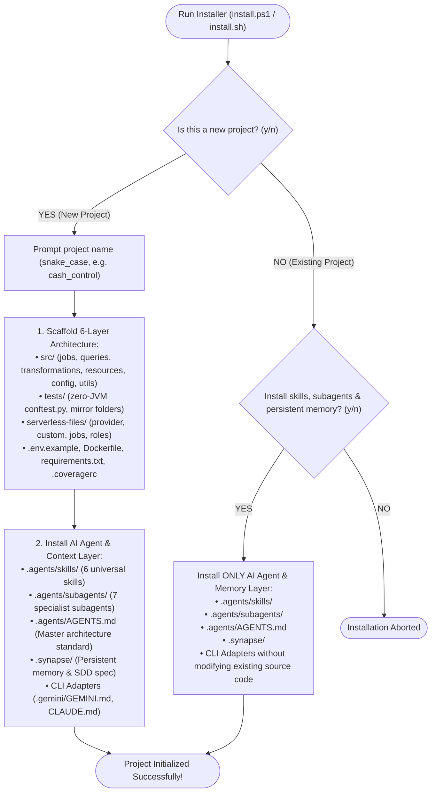

# Data Pipeline Architecture Template & AI Agent Ecosystem

Enterprise engineering blueprint, modular Infrastructure as Code (IaC), and AI agent orchestration framework for high-performance **AWS Glue + PySpark + Apache Iceberg + Serverless Framework** data pipelines.

---

## 1. Quick Installation & Setup

You can scaffold a new data pipeline or inject the AI agent intelligence layer into an existing repository using a single command:

### Windows (PowerShell)
```powershell
# Interactive installation from remote repository
irm https://raw.githubusercontent.com/Felipex576/template_agy/main/install.ps1 | iex

# Or run locally from cloned template
.\install.ps1
```

### Linux / macOS (Bash)
```bash
# Interactive installation from remote repository
curl -fsSL https://raw.githubusercontent.com/Felipex576/template_agy/main/install.sh | bash

# Or run locally from cloned template
./install.sh
```

---

## 2. Installation Modes

When executed, the installer presents an interactive decision tree:



| Mode | Target Scenario | What It Does |
|---|---|---|
| **Mode A (New Project)** | Greenfield ETL development | Generates the entire 6-layer architecture, zero-JVM testing harness, Serverless IaC, Docker files, and agent intelligence layer. |
| **Mode B (Existing Project)** | Brownfield / Existing repos | Injects `.agents/`, `.synapse/`, and CLI adapters (`.gemini/`, `CLAUDE.md`) **without altering or overwriting your existing code**. |

---

## 3. Standard 6-Layer Architecture Layout

Every pipeline generated by this template follows strict separation of concerns:

```text
<project-root>/
├── .agents/                                # AI Agent Customizations & Standards
│   ├── AGENTS.md                           # Master architecture & engineering guide
│   ├── skills/                             # Modular reusable skills
│   │   ├── athena-trino-sql/               # Athena & Trino/Presto SQL guide
│   │   ├── aws-sdk-python-usage/           # Boto3/Botocore SDK patterns
│   │   ├── glue-pyspark-iceberg/           # PySpark & Glue ETL optimization
│   │   ├── pytest-glue-pyspark/            # Zero-JVM PySpark testing harness
│   │   ├── python-etl-patterns/            # Layered Python design patterns
│   │   └── serverless-glue-iac/            # Serverless IaC & Azure DevOps CI/CD
│   └── subagents/                          # 7 Specialist Subagents with system prompts
│       ├── aws-cloud-architect.md
│       ├── devops-iac-engineer.md
│       ├── functional-analyst.md
│       ├── pyspark-data-engineer.md
│       ├── qa-testing-engineer.md
│       ├── sql-athena-specialist.md
│       └── tech-writer-specialist.md
├── .gemini/                                # Assistant behaviors & Antigravity preferences
│   └── GEMINI.md
├── .synapse/                               # Persistent Memory & SDD Framework
│   ├── PROTOCOL.md                         # 3-step lifecycle (Load Memory -> SDD -> Save)
│   ├── sdd_spec.md                         # Active SDD specification & task breakdown
│   └── memory/
│       ├── observations.json               # Structured persistent memory (decisions & rules)
│       └── sessions.csv                    # Chronological session summaries
├── src/                                    # Pipeline Source Code
│   ├── config/                             # Logger, decorators, and Spark context setup
│   ├── jobs/                               # Orchestration entrypoints ONLY (no business logic)
│   ├── queries/                            # Pure SQL extraction parameterized by date
│   ├── resources/                          # Storage I/O, table managers, and Iceberg merge
│   ├── transformations/                    # Pure, stateless business transformation rules
│   └── utils/                              # Constants, Enums, and DTO Dataclasses
├── tests/                                  # Unit Test Suite
│   └── conftest.py                         # Zero-JVM mocking harness (MockColumn, MockFunctions)
├── serverless-<service>.yml                # Root Serverless Framework entrypoint
├── serverless-files/                       # Modularized Infrastructure as Code
│   └── analytics/
│       ├── custom.yml                      # Stage resolution (dev, uat, pdn)
│       ├── provider.yml                    # AWS provider & global tags
│       └── resources/
│           ├── jobs.yml                    # AWS::Glue::Job CloudFormation definition
│           └── roles.yml                   # Least-privilege AWS::IAM::Role definition
├── azure-pipeline-<service>.yml            # Multi-stage automated Azure DevOps pipeline
├── Dockerfile                              # Reproducible test container
├── .coveragerc                             # Test coverage exclusion rules (>= 80% threshold)
├── requirements.txt                        # Pinned dependencies
└── .env.example                            # Documented environment variables (camelCase)
```

---

## 4. Layer Responsibilities & Strict Rules

| Layer | Responsibility | Strict Prohibitions |
|---|---|---|
| **`jobs/`** | Orchestrates flow: parses arguments (`getResolvedOptions`), instantiates classes, calls execution sequence, and persists. | **NO business logic:** no filters, math formulas, joins, or regex. |
| **`queries/`** | Extracts DataFrames from Glue Catalog / S3 via Spark SQL with partition pruning. | **NO complex transformations:** only project and filter by partition. |
| **`transformations/`** | Pure, stateless business rules, math calculations, and schema normalizations. | **NO I/O or AWS calls:** no `boto3`, no direct S3 writes, no argument reading. |
| **`resources/`** | Persists DataFrames: Iceberg transactional upsert/merge, ZIP archiving, S3 uploads. | **NO business logic:** managers only transmit or persist data. |
| **`config/`** | Centralizes Spark/Glue setup, logging, `@log_decorator`, and `@raise_decorator`. | **NO domain code:** no business constants or ETL logic. |
| **`utils/`** | Defines static constants (`REQUIRED_JOB_ARGS`), column Enums, and container DTOs. | **NO mutable runtime state or I/O.** |

---

## 5. Persistent Memory & SDD: Synapse Protocol

The repository includes the **Synapse Protocol** (`.synapse/`), a zero-dependency memory and specification framework:

1. **Step 1: Load Memory (`.synapse/memory/observations.json`):**
   - Loads prior architectural decisions, column enums conventions, and bug solutions before proposing code.
2. **Step 2: Spec-Driven Planning (`.synapse/sdd_spec.md`):**
   - Formulates requirements with Given-When-Then acceptance criteria and task lists before coding.
3. **Step 3: Save Learnings (`.synapse/memory/`):**
   - Appends new patterns to `observations.json` and updates `sessions.csv` upon task completion.

---

## 6. Local Development & Debugging Workflow

Local development and debugging run containerized with **Docker Compose / Rancher Desktop** emulating AWS Glue and Apache Iceberg:

```bash
# 1. Start development container
docker-compose up -d

# 2. Open interactive shell inside container
docker exec -it glue-dev-container /bin/bash

# 3. Run and debug job with debugpy (waits on port 5678)
PYTHONPATH="/repo:/repo/<job-folder>:$PYTHONPATH" python3 -m debugpy --listen 0.0.0.0:5678 --wait-for-client /repo/<job-folder>/src/jobs/<job_entrypoint>.py --JOB_NAME <job_name> --REPORT_DATE <YYYY-MM-DD>

# 4. In VS Code: Press F5 ("Attach to Glue (debugpy)") to start debugging.

# 5. Run zero-JVM unit test suite (output printed to console, no debugger needed)
PYTHONPATH="/repo:/repo/<job-folder>:$PYTHONPATH" python3 -m pytest /repo/<job-folder>/tests -q

# 6. Exit and stop services
exit
docker-compose down
```

---

## 7. Multi-CLI Compatibility

| AI Assistant / CLI | Native Support & Adapter |
|---|---|
| **Google Antigravity (AGY)** | Reads `.agents/skills/`, `.agents/subagents/`, `.agents/AGENTS.md`, and `.gemini/GEMINI.md`. |
| **Claude Code** | Reads `CLAUDE.md` and references `.agents/AGENTS.md` & `.synapse/PROTOCOL.md`. |
| **Codex / OpenCode** | Reads `AGENTS.md` and `.agents/skills/` directly from the workspace root. |
| **Cursor / Windsurf** | Compatible via `.cursorrules` / `.windsurfrules` pointing to `.agents/skills/`. |
