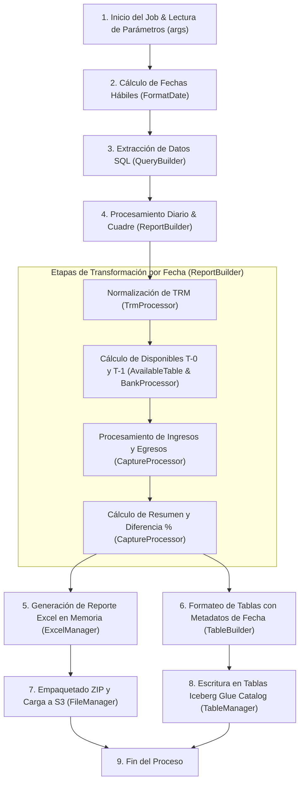

# Documentación Técnica y Funcional: Job de Control de Caja (Reporte 460)

---

## 1. Descripción

El Glue Job **Control de Caja** es un pipeline de procesamiento y conciliación financiera de datos en PySpark. Su propósito principal es calcular, conciliar y reportar diariamente los flujos de caja y la disponibilidad de recursos (en moneda local COP y divisas USD) del **Banco BTG Pactual Colombia S.A.**

El proceso calcula y cuadra dos cortes de disponibilidad:
- **Disponible T-0:** Saldo bancario disponible para la fecha de reporte anterior / de inicio.
- **Disponible T-1:** Saldo bancario proyectado o disponible para la fecha de reporte / de corte.
- **Ingresos y Egresos:** Consolidación de flujos de operaciones de mercado monetario (repos, simultáneas, divisas, TTV), movimientos Unity, cancelaciones/emisiones de CDT y bonos, créditos, confirming, ciclos ACH y compensaciones SEBRA.
- **Resumen de Disponibilidad:** Variación del disponible vs. flujo neto de caja, calculando la diferencia absoluta y porcentual.

Los resultados finales se persisten en tablas transaccionales **Apache Iceberg** en AWS Glue Catalog y se genera un reporte consolidado en **Excel (`.xlsx`)** empaquetado en un archivo comprimido **ZIP** que se almacena en Amazon S3 para consumo analítico y de auditoría.

---

## 2. Flujo del Proceso

El flujo de ejecución está orquestado por la clase `CashControl` en `src/jobs/cash_control.py`:



### Paso a paso detallado:

1. **Inicialización y Parámetros:**
   - Se inicia la sesión Spark y el contexto de AWS Glue (`src.config.spark_setup.initialize`).
   - Se validan y cargan los parámetros obligatorios del job (`REQUIRED_JOB_ARGS`).
2. **Determinación de Fechas Hábiles:**
   - La fecha de reporte (`REPORT_DATE`) se normaliza a tipo fecha (`FormatDate.parse_report_date`).
   - Se obtiene la lista de días hábiles retrospectivos (`get_last_business_days`, por defecto 5 días hábiles si es viernes o fin de mes, o el día hábil correspondiente).
   - Se calculan las fechas de día hábil previo (`previous_list`) y siguiente (`next_list`) para cada día del rango.
3. **Extracción de Datos (Glue Data Catalog):**
   - A través de `QueryBuilder`, se ejecutan consultas Spark SQL sobre 7 bases de datos y 18 tablas del Data Lake para extraer las operaciones asociadas a las fechas requeridas.
   - Todos los DataFrames leídos se consolidan en la estructura `ProcessingDataFrames`.
4. **Transformación y Consolidación Diaria (`ReportBuilder.create_report`):**
   - Para cada fecha del rango se calculan:
     - TRM correspondiente.
     - Saldos disponibles bancarios T-0 y T-1.
     - Ingresos y egresos clasificados por producto/concepto.
     - Resumen de flujo y porcentaje de diferencia.
   - Los resultados diarios se acumulan mediante `unionByName`.
5. **Generación del Archivo Excel (`ExcelManager.generate_excel`):**
   - Se construye un libro de trabajo en memoria con la hoja `"Control Caja"`.
   - Se escriben las 5 secciones (`INGRESOS`, `EGRESOS`, `DISPONIBLE T-0`, `DISPONIBLE T-1` y `RESUMEN DISPONIBLE`) con fechas en columnas, aplicando formato monetario `"$#,##0.00"` y porcentaje `0.00%`.
   - Se retorna el contenido directamente como `bytes`.
6. **Estructuración de Tablas Iceberg (`TableBuilder.create_table`):**
   - A cada DataFrame se le asignan las columnas de auditoría: `fecha_reporte` (tipo `DateType`), `fecha_generacion` (`current_date()`) y `tipo_disponible` (para las tablas de disponible).
   - Se unen `final_t0_df` y `final_t1_df` en `available_df`.
7. **Persistencia y Entrega:**
   - `TableManager.upload_table`: Realiza creación, sincronización de esquema (`synchronize_schema`) y mezcla de datos (`merge_data`) en las 4 tablas Iceberg del catálogo (`income_table`, `expense_table`, `available_table`, `summary_table`).
   - `FileManager.upload_file`: Comprime el Excel en un archivo ZIP (`f_control_caja_{entity}{YYYYMMDD}.zip`) y lo sube mediante `boto3.s3` a los buckets configurados (`trusted_bucket` y `chronos_bucket`).

---

## 3. Arquitectura y Componentes

```mermaid
graph TD
    subgraph Jobs
        CashControl["src.jobs.cash_control.CashControl"]
    end

    subgraph Queries
        QueryBuilder["src.queries.query_builder.QueryBuilder"]
    end

    subgraph Transformations
        ReportBuilder["ReportBuilder"]
        TableBuilder["TableBuilder"]
        CaptureProcessor["CaptureProcessor"]
        BankProcessor["BankProcessor"]
        AvailableTable["AvailableTable"]
        T1Processor["T1Processor"]
        MoneyMarketProcessor["MoneyMarketProcessor"]
        UnityProcessor["UnityProcessor"]
        CdtProcessor["CdtProcessor"]
        PygProcessor["PygProcessor"]
        CycleProcessor["CycleProcessor (ACH)"]
        AchProcessor["AchProcessor"]
        CreditProcessor["CreditProcessor"]
        InputProcessor["InputProcessor"]
        FormatDate["FormatDate"]
        TrmProcessor["TrmProcessor"]
    end

    subgraph Resources
        ExcelManager["ExcelManager"]
        FileManager["FileManager"]
        TableManager["TableManager"]
    end

    CashControl --> QueryBuilder
    CashControl --> FormatDate
    CashControl --> ReportBuilder
    CashControl --> TableBuilder
    CashControl --> ExcelManager
    CashControl --> FileManager
    CashControl --> TableManager

    ReportBuilder --> TrmProcessor
    ReportBuilder --> AvailableTable
    ReportBuilder --> CaptureProcessor

    AvailableTable --> BankProcessor
    CaptureProcessor --> MoneyMarketProcessor
    CaptureProcessor --> UnityProcessor
    CaptureProcessor --> T1Processor
    CaptureProcessor --> CdtProcessor
    CaptureProcessor --> PygProcessor
    CaptureProcessor --> CycleProcessor
    CaptureProcessor --> AchProcessor
    CaptureProcessor --> CreditProcessor
    CaptureProcessor --> InputProcessor
```



### Descripción de Responsabilidades

| Módulo / Clase | Responsabilidad Principal |
| :--- | :--- |
| **`CashControl`** (`src.jobs.cash_control`) | Orquestador principal del pipeline. Inicializa Spark/Glue, gestiona argumentos, controla el flujo de extracción, transformación, exportación a Excel y persistencia. |
| **`QueryBuilder`** (`src.queries.query_builder`) | Construye y ejecuta las consultas Spark SQL parametrizadas sobre las tablas del Glue Catalog con filtrado por rangos y fechas normalizadas. |
| **`FormatDate`** (`src.transformations.format_date`) | Gestión de calendario financiero, cálculo de días hábiles colombianos (vía `holidays_co`), cálculo de días anteriores/siguientes y ventanas históricas de días hábiles. |
| **`ReportBuilder`** (`src.transformations.report_builder`) | Itera el rango de fechas de corte, coordina las transformaciones diarias acumulando los DataFrames resultantes. |
| **`TableBuilder`** (`src.transformations.table_builder`) | Inyecta metadatos a los DataFrames finales: columna `tipo_disponible`, columna `fecha_reporte` (`DateType`) y `fecha_generacion` (`current_date()`). |
| **`CaptureProcessor`** (`src.transformations.capture_unit_processor`) | Consolidación central de los rubros de ingresos y egresos según los enums `Incomes` y `Expenses`. Calcula el resumen de disponible y porcentaje de diferencia. |
| **`AvailableTable`** (`src.transformations.available_table`) | Calcula la estructura de Disponibles (Banco de la República, Bancos Comerciales, Bancos USD a TRM y Total). |
| **`BankProcessor`** (`src.transformations.bank_processor`) | Procesamiento de saldos bancarios por cuenta (BanRep no remunerada/remunerada, ahorros, cuentas administrativas y cuentas USD). Maneja excepciones de fin de año. |
| **`MoneyMarketProcessor`** (`src.transformations.money_market_processor`) | Filtra y agrega operaciones de mercado monetario (simultáneas TES/privadas, definitivas compra/venta, repos, compras/ventas de divisas y TTVs). |
| **`UnityProcessor`** (`src.transformations.unity_processor`) | Homologa movimientos operativos con el maestro contable de Unity/SEBRA y aplica la lógica de signos a notas débito (ND). |
| **`T1Processor`** (`src.transformations.t_1_processor`) | Cálculos específicos de movimientos T+1 (operaciones Unity, transferencias bancarias en COP/USD, cheques y dividendos). |
| **`CdtProcessor`** (`src.transformations.cdt_processor`) | Agregación de renovaciones de CDTs y clasificación de recompras vs. emisiones de CDTs/bonos según tipo de participación. |
| **`PygProcessor`** (`src.transformations.pyg_processor`) | Agrega la utilidad contable de derivados estandarizados para la entidad. |
| **`CycleProcessor`** (`src.transformations.ach_cycle_processor`) | Clasifica y agrega transacciones ACH por franjas horarias (5 ciclos de retiros/depósitos) y traslados/devoluciones de fondos SEBRA. |
| **`AchProcessor`** (`src.transformations.ach_processor`) | Normaliza devoluciones ACH, depósitos CUD y emparejamiento de devoluciones no autorizadas para ciclos >= 4. |
| **`CreditProcessor`** (`src.transformations.credit_processor`) | Calcula recaudos/desembolsos de cartera comercial y confirming desde Mambu y adaptador de conciliación. |
| **`InputProcessor`** (`src.transformations.input_processor`) | Integra entradas de movimientos diarios y variaciones para el cuadre T+1. |
| **`TrmProcessor`** (`src.transformations.trm_processor`) | Normaliza y obtiene el valor de la TRM para la fecha requerida. |
| **`ExcelManager`** (`src.resources.excel_manager`) | Construye el archivo Excel `.xlsx` en memoria con formato tabular, autoajuste de columnas y estilos numéricos. |
| **`FileManager`** (`src.resources.file_manager`) | Empaqueta el reporte Excel en un archivo ZIP y lo carga a los buckets S3 de destino (`trusted` y `chronos`). |
| **`TableManager`** (`src.resources.table_manager`) | Interactúa con la librería `datafoundation.iceberg` para crear tablas, sincronizar esquemas y ejecutar operaciones `MERGE` en Glue Catalog. |

---

## 4. Fuentes de Datos

Las consultas se ejecutan sobre las bases de datos registradas en AWS Glue Catalog (`glue_catalog.{database}.{table}`):

| Base de Datos (Parámetro) | Tabla (Parámetro) | Campos Principales Extraídos | Propósito |
| :--- | :--- | :--- | :--- |
| `RTBCOL_DATABASE` | `BANK_BALANCES_TABLE` | `numero_cuenta`, `nombre_titular_cuenta`, `nombre_banco`, `tipo_cuenta`, `saldo_bancario_final`, `saldo_en_canje`, `fecha_movimiento` | Saldos diarios de cuentas bancarias en BanRep y bancos comerciales. |
| `RTBCOL_DATABASE` | `MONEY_MARKET_TABLE` | `fecha_operacion`, `fecha_cumplimiento`, `cod_central_deposito`, `clasificacion`, `tipo_sim`, `codigo_especie`, `nemotecnico`, `tipo_operacion`, `genera_detalle`, `valor_de_giro` | Operaciones de mercado monetario (SIM, REPO, NORMAL, TTV). |
| `UNITY_DATABASE` | `UNITY_OPERATIONS_TABLE` | `consecutivo`, `fecha_cuadre`, `clasificacion`, `liquidacion`, `tipo_operacion`, `fecha_futura` | Maestro de operaciones Unity (se usa en joins con mercado monetario y movimientos). |
| `UNITY_DATABASE` | `CC_MOVEMENTS_TABLE` | `concepto`, `valor`, `cod_tipo_movimiento`, `fecha`, `cuenta_bancaria`, `rendimiento`, `operacion` | Movimientos en cuentas corrientes operativas de Unity. |
| `RTBCOL_DATABASE` | `MASTER_HOMOLOGATION_TABLE` | `codigo_contable`, `codigo_cud`, `concepto_cud` | Maestro de homologación contable Unity - SEBRA. |
| `RTBCOL_DATABASE` | `MULTICASH_MOVEMENTS_TABLE` | `cuenta_bancaria`, `moneda`, `monto`, `fecha_mvto` | Movimientos bancarios multicash (extractos en COP y USD). |
| `RTBCOL_DATABASE` | `UMBRELLA_MASTER_TABLE` | `cuenta_bancaria`, `titular`, `estado` | Cuentas maestras Umbrella activas de BTG Pactual. |
| `TRM_DATABASE` | `TRM_TABLE` | `valor`, `vigencia_desde`, `vigencia_hasta` | Histórico de Tasa Representativa del Mercado. |
| `DOMINUS_DATABASE` | `RENEWAL_OPERATIONS_TABLE` | `total_renovacion`, `fecha_operacion` | Renovaciones de CDTs en Dominus. |
| `DOMINUS_DATABASE` | `OPERATIONS_A_TABLE` | `id`, `codigo_isin`, `fecha_operacion`, `precio_contado`, `fecha_inicio`, `fecha_fin` | Cabecera de operaciones tipo A en Dominus (recompras/emisiones). |
| `DOMINUS_DATABASE` | `OPERATIONS_B_TABLE` | `id_padre`, `saldo`, `tipo_participacion`, `nombre_inversion` | Detalle tipo B en Dominus (`tipo_participacion` 1: Recompra, 2: Emisión). |
| `RTBCOL_DATABASE` | `STANDARDIZED_DERIVATIVES_TABLE`| `descripcion`, `tipo_cumplimiento`, `utilidad`, `fecha_inicial` | Resultados P&G de derivados estandarizados (`tipo_cumplimiento = 'F'`). |
| `MAMBU_CC_DATABASE` | `MAMBU_ACCOUNTS_TABLE` | `clave_codificada`, `id`, `fecha_ultima_modificacion` | Cuentas Mambu (deduplicadas por última modificación). |
| `MAMBU_CC_DATABASE` | `MAMBU_TRANSACTIONS_TABLE` | `monto`, `fecha_hora_valor`, `fecha_valor`, `clave_cuenta_padre`, `detalles_transaccion_clave_canal_transaccion` | Transacciones de cuentas corrientes en Mambu. |
| `MAMBU_CC_DATABASE` | `MAMBU_CHANNELS_TABLE` | `clave_codificada`, `nombre` | Catálogo de canales de transacción Mambu. |
| `CHECKING_ACCOUNTS_DATABASE` | `BALANCE_TABLE` | `id_cuenta`, `fecha_saldo`, `total_balance` | Balances diarios de cuentas de depósito. |
| `CHECKING_ACCOUNTS_DATABASE` | `DEPOSIT_ACCOUNT_TABLE` | `id_cuenta_deposito`, `id_producto` | Catálogo de cuentas de depósito filtradas por productos permitidos. |
| `ADAPTER_DATABASE` | `RECONCILIATION_ADAPTER_TABLE` | `transaction_type`, `name`, `status`, `reg6_cuenta_receptora`, `reg5_entidad_originadora`, `reg5_nombre_originador`, `reg6_entidad_receptora`, `reg6_nombre_cliente_receptor`, `reg6_valor_transaccion`, `fecha_consulta` | Transacciones del adaptador de conciliación ACH y pagos originados. |

---

## 5. Reglas de Negocio y Procesamiento

### 5.1. Tratamiento de Calendario y Fechas
- **Días Hábiles:** Evaluados mediante `holidays_co`. Se excluyen fines de semana (sábado y domingo) y festivos oficiales en Colombia.
- **Ventana de Ejecución:** Si la fecha corresponde a un viernes o a fin de mes, se procesa una secuencia de los últimos 5 días hábiles; de lo contrario, se procesa la fecha de reporte indicada.
- **Ajuste de Fin de Año:** Si la fecha evaluada es 31 de diciembre o 1 de enero, `BankProcessor.adjust_year_end_dates` ajusta el desfase de días festivos/bancarios de cierre de año.

### 5.2. Disponibles Bancarios (T-0 y T-1)
- **Banco de la República:**
  - Cuentas no remuneradas: `62015990` y `62015991`.
  - Cuenta remunerada: `64011480`.
- **Bancos Comerciales COP:**
  - Cuentas de Ahorros: Davivienda (`570033570004227`), Occidente (`423816990`), Bogotá (`434381323`), Bancolombia (`61100001577`).
  - Cuentas Administrativas: Davivienda, Bogotá y Bancolombia.
- **Cuentas en USD (Convertidas a COP según TRM):**
  - Cuentas en Cayman, BofA (`1901751916`), Citi (`14674340`, `36442812`, `36506441`), Bancolombia Panamá (`80110003748`) y Bradesco (`30863139`).
  - Para cada cuenta en USD se deduce el saldo en canje: `saldo_neto = saldo_bancario_final - abs(saldo_en_canje)`.
  - El total en USD se multiplica por la TRM del día para integrarlo en el disponible total.

### 5.3. Ingresos y Egresos Operativos
- **Mercado Monetario:**
  - Simultáneas activas/pasivas sobre TES (`codigo_especie LIKE 'CT%'`) y privadas (`CA|CB|CD|CH|CI|CP|CS|MM`).
  - Operaciones definitivas de compra/venta filtradas por custodio (`DCV`, `DVL`).
  - Repos activos y pasivos.
  - Compra y venta de divisas / Money Market (`nemotecnico = 'MONEYMARKET'`).
- **CDTs y Bonos:**
  - Renovaciones de CDTs sumadas de la tabla de Dominus.
  - Recompras (`tipo_participacion = '1'`) e integraciones de emisiones de CDT (`IS_IN: COB70CD`) y Bonos (`IS_IN: COB70CB`).
- **Ciclos ACH (Horarios y Franjas):**
  - Segmentación por 5 ventanas horarias de corte para retiros (`00:00-08:31`, `08:31-11:01`, `11:01-13:31`, `13:31-15:34`, `15:34-23:59`) y depósitos (`00:00-10:30`, `10:30-13:00`, `13:00-15:30`, `15:30-17:30`, `17:30-23:59`).
  - Conciliación de devoluciones ACH no autorizadas en ciclos 4 y 5 contra el adaptador de conciliación.
- **Crédito y Confirming:**
  - Cuentas Mambu: Crédito (`12528874205`) y Confirming (`12561730308`).
  - Deducción de conceptos de recarga y descarga de saldos.
  - Integración de movimientos SEBRA débito/crédito.

### 5.4. Resumen de Disponibilidad y Cuadre
- **Variación de Disponible:** `variacion_disponible = Total_T0 - Total_T1`
- **Flujo Total:** `flujo_total = Total_Ingresos - Total_Egresos`
- **Diferencia:** `diferencia = variacion_disponible - flujo_total`
- **Porcentaje de Diferencia:**
  $$\text{porcentaje\_diferencia} = \begin{cases} \left(\frac{\text{diferencia}}{\text{Total\_T1}}\right) \times 100 & \text{si Total\_T1} \neq 0 \\ 0.0 & \text{si Total\_T1} = 0 \end{cases}$$

---

## 6. Salidas del Proceso

### 6.1. Tablas Apache Iceberg (AWS Glue Catalog)
Los datos estructurados se almacenan en formato Iceberg particionados por `fecha_reporte`:

| Tabla Destino (Parámetro) | Esquema / Columnas Principales | Claves de Merge |
| :--- | :--- | :--- |
| `INCOME_TABLE` | Rubros de ingresos (`Incomes`), `total`, `fecha_reporte`, `fecha_generacion` | `fecha_reporte` |
| `EXPENSE_TABLE` | Rubros de egresos (`Expenses`), `total`, `fecha_reporte`, `fecha_generacion` | `fecha_reporte` |
| `AVAILABLE_TABLE` | `banco_republica`, `bancos_comerciales`, `bancos_usd`, `trm`, `total`, `tipo_disponible`, `fecha_reporte`, `fecha_generacion` | `fecha_reporte`, `tipo_disponible` |
| `SUMMARY_TABLE` | `disponible_t_0`, `disponible_t_1`, `variacion_disponible`, `ingresos`, `egresos`, `total_flujo`, `diferencia`, `porcentaje_diferencia`, `fecha_reporte`, `fecha_generacion` | `fecha_reporte` |

### 6.2. Archivo Excel y Paquete ZIP en S3
- **Archivo Excel (`.xlsx`):** Contiene la hoja `"Control Caja"` con el encabezado de fechas en columnas horizontales y las 5 secciones de datos con formateo de moneda y porcentaje.
- **Archivo ZIP:** Generado en memoria con nombre `f_control_caja_{entity}{YYYYMMDD}.zip` que contiene `f_control_caja_{entity}{YYYYMMDD}.xlsx`.
- **Rutas S3 de Almacenamiento:**
  - `s3://{TRUSTED_BUCKET}/{PREFIX_FILE}/control_caja/{COMPANY}/{YYYY-MM-DD}/f_control_caja_{COMPANY}{YYYYMMDD}.zip`
  - `s3://{CHRONOS_BUCKET_NAME}/{OUTPUT_FILE_PATH}`

---

## 7. Parámetros y Configuración

El job requiere los siguientes argumentos en tiempo de ejecución (`sys.argv`):

| Parámetro (`args`) | Descripción | Ejemplo / Valor |
| :--- | :--- | :--- |
| `JOB_NAME` | Nombre del Job de AWS Glue. | `job-analytics-regulatory-reporting-control-caja` |
| `REPORT_DATE` | Fecha de corte solicitada (formato ISO). | `2026-01-09T05:00:00.000Z` |
| `REPORT_TYPE` | Tipo / identificador del reporte. | `Control Caja` |
| `COMPANY` | Nombre de la entidad. | `Banco` |
| `MARKET_DATABASE` | Base de datos de destino en Glue Catalog para las tablas de salida. | `database_glue_market_risk` |
| `INCOME_TABLE` | Nombre de la tabla de ingresos. | `tblcontrol_caja_ingresos` |
| `EXPENSE_TABLE` | Nombre de la tabla de egresos. | `tblcontrol_caja_egresos` |
| `AVAILABLE_TABLE` | Nombre de la tabla de disponibles. | `tblcontrol_caja_disponible` |
| `SUMMARY_TABLE` | Nombre de la tabla de resumen de caja. | `tblcontrol_caja_resumen` |
| `RTBCOL_DATABASE` | Base de datos Glue de fuentes RTBCOL. | `database_glue_fuentes_rtbcol` |
| `UNITY_DATABASE` | Base de datos Glue de fuentes Unity. | `database_glue_fuentes_unity` |
| `TRM_DATABASE` | Base de datos Glue de TRM. | `database_glue_trm` |
| `DOMINUS_DATABASE` | Base de datos Glue de Dominus. | `database_glue_analytics_dominus` |
| `MAMBU_CC_DATABASE` | Base de datos Glue de Cuentas Corrientes Mambu. | `database_glue_analytics_mambu_cuentas_corrientes` |
| `CHECKING_ACCOUNTS_DATABASE` | Base de datos Glue de Cuentas Corrientes Analytics. | `database_glue_analytics_cuentas_corrientes` |
| `ADAPTER_DATABASE` | Base de datos Glue del Adaptador de Conciliación. | `database_glue_adaptor_conciliacion` |
| `UNITY_OPERATIONS_TABLE` | Tabla de operaciones Unity. | `tbloperaciones_unity` |
| `BANK_BALANCES_TABLE` | Tabla de saldos diarios bancarios. | `tblsaldos_diarios_cuentas_bancarias` |
| `MONEY_MARKET_TABLE` | Tabla de mercado monetario. | `tblmercado_monetario` |
| `CC_MOVEMENTS_TABLE` | Tabla de movimientos de cuentas corrientes. | `tblmovimientos_cuentas_cc` |
| `MASTER_HOMOLOGATION_TABLE` | Tabla maestra de homologación Unity - SEBRA. | `tblmaestro_homologacion_unity_sebra` |
| `MULTICASH_MOVEMENTS_TABLE` | Tabla de movimientos multicash. | `tblmulticash_movimientos` |
| `UMBRELLA_MASTER_TABLE` | Tabla maestra de cuentas Umbrella. | `tblmaestro_cuentas_umbrella` |
| `TRM_TABLE` | Tabla de histórico de TRM. | `tbltrm` |
| `RENEWAL_OPERATIONS_TABLE` | Tabla de renovaciones CDT. | `tbloperaciones_renovacion` |
| `OPERATIONS_A_TABLE` | Tabla de operaciones tipo A Dominus. | `tbloperaciones_tipo_a` |
| `OPERATIONS_B_TABLE` | Tabla de operaciones tipo B Dominus. | `tbloperaciones_tipo_b` |
| `STANDARDIZED_DERIVATIVES_TABLE`| Tabla de derivados estandarizados. | `tblderivados_estandarizados` |
| `MAMBU_ACCOUNTS_TABLE` | Tabla de cuentas Mambu. | `tblcuentas` |
| `MAMBU_TRANSACTIONS_TABLE` | Tabla de transacciones Mambu. | `tbltransacciones` |
| `MAMBU_CHANNELS_TABLE` | Tabla de canales Mambu. | `tblcanales` |
| `BALANCE_TABLE` | Tabla de balances de cuentas corrientes. | `tblbalance` |
| `DEPOSIT_ACCOUNT_TABLE` | Tabla de cuentas de depósito. | `tblcuenta_deposito` |
| `RECONCILIATION_ADAPTER_TABLE` | Tabla del adaptador de conciliación. | `tbladaptor_conciliacion` |
| `TRUSTED_BUCKET` | Bucket S3 Data Lake Trusted. | `s3-analytics-trusted` |
| `CHRONOS_BUCKET_NAME` | Bucket S3 de entrega a Chronos. | `s3-chronos-bucket` |
| `PREFIX_DATA` | Prefijo S3 para datos de Data Lake. | `data` |
| `PREFIX_FILE` | Prefijo S3 para archivos y reportes. | `files` |
| `OUTPUT_FILE_PATH` | Ruta de salida en bucket Chronos. | `output/f_control_caja.zip` |
| `PROJECT_BUCKET_NAME` | Bucket S3 principal del proyecto. | `s3-analytics-project` |

---

## 8. Dependencias del Proyecto

- **Python Runtime:** Python 3.9 / 3.11.
- **Frameworks y Motores:**
  - `pyspark == 3.5.x`: Procesamiento distribuido y DataFrames.
  - `awsglue`: Utilidades y contexto Glue (`GlueContext`, `Job`, `getResolvedOptions`).
  - `openpyxl == 3.1.5`: Creación y formateo de libros Excel.
  - `holidays-co == 1.1.3`: Determinación de días festivos en Colombia.
  - `boto3`: Cliente AWS SDK para operaciones S3.
  - `datafoundation`: Librería corporativa para gestión de tablas Iceberg (`IcebergTableManager`).
- **Pruebas y Calidad de Código:**
  - `pytest == 8.3.4`
  - `pytest-cov == 6.0.0`
  - `unittest.mock`

---

## 9. Estructura del Proyecto

```text
control-caja/
├── .env                                       # Variables de entorno para despliegue Serverless
├── Dockerfile                                 # Contenedor de pruebas CI/CD y SonarQube
├── control_caja.md                            # Documentación técnica del job
├── requirements.txt                           # Dependencias base de ejecución
├── serverless-analytics-control-caja.yml      # Configuración de Serverless Framework
├── serverless-files/
│   └── analytics/
│       ├── custom.yml                         # Mapeo de variables y configuración por stage
│       ├── provider.yml                       # Configuración de AWS Provider
│       └── resources/
│           ├── jobs.yml                       # Definición del Glue Job y DefaultArguments
│           └── roles.yml                      # IAM Roles y políticas de ejecución
├── src/
│   ├── config/
│   │   ├── decorators.py                      # Decoradores @log_decorator y @raise_decorator
│   │   ├── logger.py                          # Configuración estándar de logging
│   │   └── spark_setup.py                     # Inicialización de GlueContext y SparkSession
│   ├── jobs/
│   │   └── cash_control.py                    # Punto de entrada y orquestación del Glue Job
│   ├── queries/
│   │   └── query_builder.py                   # Construcción de consultas SQL a Glue Catalog
│   ├── resources/
│   │   ├── excel_manager.py                   # Generación del archivo Excel en memoria (bytes)
│   │   ├── file_manager.py                    # Empaquetado ZIP y subida a Amazon S3
│   │   └── table_manager.py                   # Operaciones Iceberg (create, sync, merge)
│   ├── transformations/
│   │   ├── ach_cycle_processor.py             # Procesamiento de ciclos ACH y saldos
│   │   ├── ach_processor.py                   # Normalización de devoluciones y CUD ACH
│   │   ├── available_table.py                 # Construcción de la tabla de Disponibles
│   │   ├── bank_processor.py                  # Cálculo de saldos bancarios y conversión USD
│   │   ├── capture_unit_processor.py          # Consolidación de ingresos, egresos y resumen
│   │   ├── cdt_processor.py                   # Procesamiento de CDTs, recompras y emisiones
│   │   ├── credit_processor.py                # Procesamiento de créditos y confirming
│   │   ├── format_date.py                     # Utilidades de fechas y días hábiles
│   │   ├── input_processor.py                 # Generación de entradas de cuadre diario T+1
│   │   ├── money_market_processor.py          # Operaciones de mercado monetario
│   │   ├── pyg_processor.py                   # Resultados P&G de derivados estandarizados
│   │   ├── report_builder.py                  # Iterador por fechas y acumulador de reportes
│   │   ├── t_1_processor.py                   # Transformaciones de movimientos T+1
│   │   ├── table_builder.py                   # Inyección de columnas de fecha y disponibles
│   │   ├── trm_processor.py                   # Normalización de TRM
│   │   └── unity_processor.py                 # Homologación y cálculo de conceptos Unity
│   └── utils/
│       ├── classes.py                         # Dataclass ProcessingDataFrames
│       ├── constants.py                       # Constantes de negocio, consultas y formatos
│       ├── enums.py                           # Enums Incomes, Expenses, Available, Summary
│       └── variables.md                       # Detalle de variables de entorno para Azure Library
└── tests/                                     # Suite de pruebas unitarias (111 tests, 98% cobertura)
    ├── conftest.py                            # Configuración de fixtures y mocks de PySpark/Glue
    ├── config/                                # Tests de configuración Spark
    ├── jobs/                                  # Tests de orquestación (CashControl)
    ├── queries/                               # Tests de consultas (QueryBuilder)
    ├── resources/                             # Tests de ExcelManager, FileManager, TableManager
    └── transformations/                       # Tests de los 16 procesadores de transformación
```
